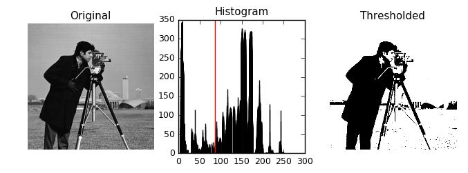
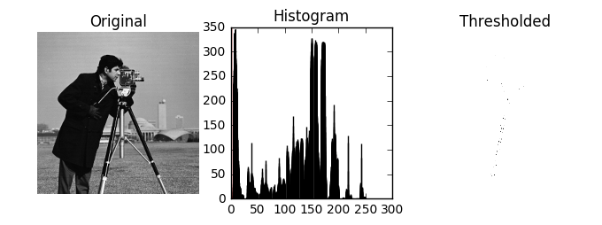
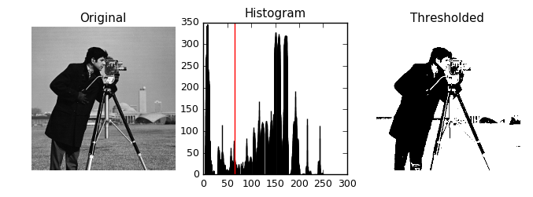
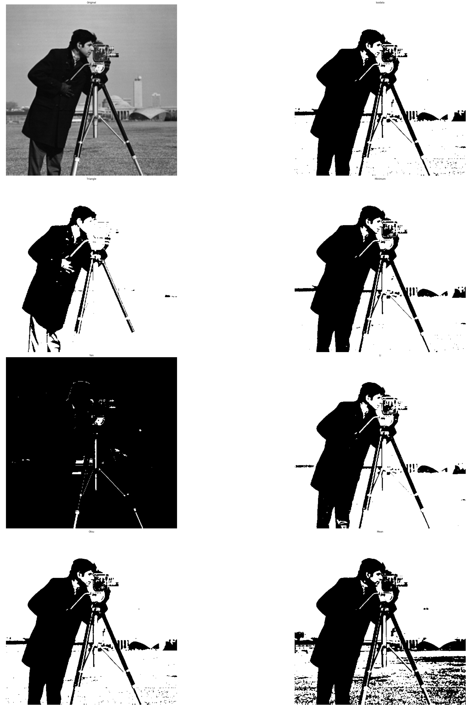

## Tresholding: 

This technique is one of the simplest in image segmentation, it aims to change each pixel to black or white depending on its comparison with some fixed value. Usually for the picking of  this value, several tecnhiques can be used: 

* Histogram Shape
* Clustering
* Entropy
* Object Attributes
* Spacial distribution
* Local changes of a region. 

Some known algorithms and its results are: 

### Algorithms:

#### Otsu's: 

After calculating a histogram, an analysis of the distribution of the gray values of an image are taken into an account. The minimun between the two peaks in a bimodal histofram is chosen as threshold. Some of its drawbacks is that generally a single threshold can't give a good segmentation. 


```python
import matplotlib
import matplotlib.pyplot as plt

from skimage.data import camera
from skimage.filters import threshold_otsu,threshold_li,threshold_adaptive

matplotlib.rcParams['font.size'] = 9


image = camera()
thresh = threshold_otsu(image)
threshli = threshold_li(image)
binary = image > thresh

#fig, (ax1, ax2, ax3) = plt.subplots(1, 3, figsize=(8, 2.5))
fig = plt.figure(figsize=(8, 2.5))
ax1 = plt.subplot(1, 3, 1, adjustable='box-forced')
ax2 = plt.subplot(1, 3, 2)
ax3 = plt.subplot(1, 3, 3, sharex=ax1, sharey=ax1, adjustable='box-forced')

ax1.imshow(image, cmap=plt.cm.gray)
ax1.set_title('Original')
ax1.axis('off')

ax2.hist(image)
ax2.set_title('Histogram')
ax2.axvline(thresh, color='r')

ax3.imshow(binary, cmap=plt.cm.gray)
ax3.set_title('Thresholded')
ax3.axis('off')

plt.show()
```





```python
%matplotlib inline
```


```python
%matplotlib inline
import numpy as np
import matplotlib.pyplot as plt
from skimage.data import camera
def plot(thresh):
    image = camera()
    binary = image > thresh
    fig = plt.figure(figsize=(8, 2.5))
    ax1 = plt.subplot(1, 3, 1, adjustable='box-forced')
    ax2 = plt.subplot(1, 3, 2)
    ax3 = plt.subplot(1, 3, 3, sharex=ax1, sharey=ax1, adjustable='box-forced')

    ax1.imshow(image, cmap=plt.cm.gray)
    ax1.set_title('Original')
    ax1.axis('off')

    ax2.hist(image)
    ax2.set_title('Histogram')
    ax2.axvline(thresh, color='r')

    ax3.imshow(binary, cmap=plt.cm.gray)
    ax3.set_title('Thresholded')
    ax3.axis('off')

    plt.show()

```


```python
from IPython.html.widgets import interact,IntSlider


interact(plot,
               thresh=IntSlider(min=0,max=300)
               )
```





    <function __main__.plot>


####  Li: 

Proposes to use a 2d histogram. 


```python
threshli = threshold_li(image)
plot(thresh)
plot(threshli)
```





### Composite Methods

*  Huang  Chau:

Ge propossed to compute first a gaussian mixture model or EM, and then look for the threshold average of means. 

* Maitra chatterje: 

BActerial foraging. 

* Rogowska : 

Proposed to divide an image into groups: 
    
    * Less 
    * Equal 
    * Mayor
Some preprocessing might be required. 

* Zhang : 

First automatic, fast, robust and accurate segmentation for bones.  Using a 3d adaptative thresholding.  Basically diferencing bone and no bone images. It uses iterative 3d correlation to validate voxel clasification. 

* Vijay: 

Used an adaptative filter, reducing the noises but adding some blur. Then implemented an adaptative wavelet thresholding was applied with multiscale product rule in the second step. 


```python
from skimage.data import camera
from skimage.filters import try_all_threshold
fig, ax = try_all_threshold(camera(), figsize=(50, 50), verbose=False)

```





Resources: 

[1] E.A. Zanaty, Medical Image Segmentation Techniques: An Overview,Taif University, Saudi Arabia, Overview, 2016. 

[2] Stéfan van der Walt, Johannes L. Schönberger, Juan Nunez-Iglesias, François Boulogne, Joshua D. Warner, Neil Yager, Emmanuelle Gouillart, Tony Yu and the scikit-image contributors. scikit-image: Image processing in Python. PeerJ 2:e453 (2014)

