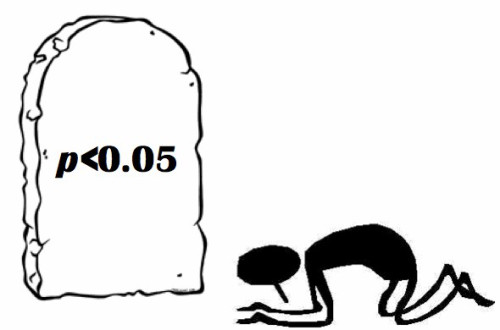

In the last years a rising concern on the proper use of p-values has impacted the scientific community. The wrong usage of this measurement, has lead to a biased results and conclusions that 
urged the comunity to review the right implementation of this metric and in some more extreme cases to completely discourage its use. The ASA (American Statistics Association) in an effort to delimit the scope and limitations of such, released less than a year ago "The ASA's Statement on P-values: Context, Process and Purpose".[1]

In many papers of a very wide comunity of scientist, statements such as "With a significance of 99.95%,  we conclude... " became widely accepted,  even when methods and conclusions were questionable or insufficient to make such strong statements.  As the article recalled, a question and discussion regarding  the metric was summarized in the following anecdotical quote:
"Why we use p-values? Because we were thaught to use them. Why we were taught to use them, because its what the scientist use". This lead to a great need of principles and non-technical descriptions that could help scientist to use statistician tools properly. 

There are 6  key principles addessed by the statement:

* **p-Values can indicate how incompatible the data are with specified statiscal model.**
	
	A p-Value provides a metric that measures the compatibility between a particular set of data and a proposed model for the data. For instance the  null hypothesis, where the smaller the p-Value is the greater incompatibility of the data with the null hypothesis. This could  provide evidence against the null hypothesis or the underlying assumptions. 
* **p-Values do not measure the probability that the studied hypothesis is true, or the probability that the data were produced by random chance alone**
	
	One of the common mistakes reaserchers make is to understand the p-Value as a truth measurement of the null hypothesis Or as the probability that random chance produced the observed data. p-Values are neither. It is a statement of relationship between the data and a specified hypothetical explanation. 
* **Scientific conclusions and business or policy decisions should not be based only on wheter a p-value passes a specific threshold**

	The common based statement that "statistical significance" (p≤ 0.05) may lead to a distortion of the reality and when is presented without contextual information about the methods or data collection procedures, may lead to wrong or imprecise assumptions. By themselves p-values can not assure that some conclusion or policy is correct based on the significance of the p-value. 

* **Proper inference requires full reporting and transparency**

	Cherry picking promising results or practices such as data dredging, significance chasing, selective inference, should be vigourosly avoided. 

* **A p-Value, or statistical significance, does not measure the size of an effect or the importance of the result**
	
	Usually the "95%" , "99.95%"  or "99.99%". Significance in a statement may lead wrongly to believe that this is a measurement of the importance of the study. However statistician significance is not equivalent to scientific, human or economic significance. For example, small p-values do not necessary imply the presence of larger or more important effects. Any effect , no matter how tiny, can produce a small p-value. Is also important to note that small sizes or imprecise measurements can lead to small or large p-values. 

* **By itself a p-value does not provide a good measure of evidence regarding a good measure of evidence regarding a model or hypothesis**
	
	p-Values by itself provides poor and limited information. The model in consideration maybe innadequate for studying a particular data. Then an small p-value can be wrongly assumed to be a good measurement for testing the hypothesis, when other models are more accurate or consistent with the data in consideration. 

These very simple but profound principles, aim to improve and clarifify the statistical usage of p-values or at least help researchers to avoid presumptuos usage of language when using them alone. This also is a good call to the scientific comunity to always rely on the scientific method and try not to use shortcuts such as only using the p-values inadecuately to prove hypothesis. In conclusion as the article itself finishes: " No single index should be substitute for scientific reasoning." 

## Resources: 

[1] R. L. Wasserstein & Nicole A. Lazar, The ASA's Statement on P-values: Context, Process and Purpose, The American Statistician, 70:2, 129-133. 

