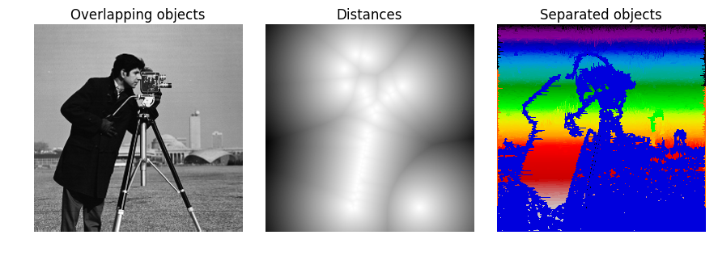
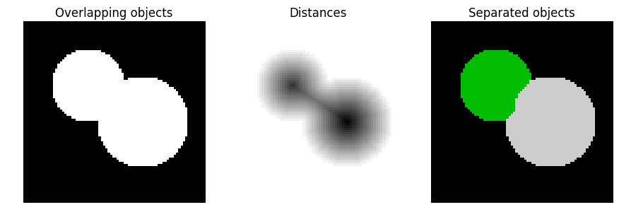
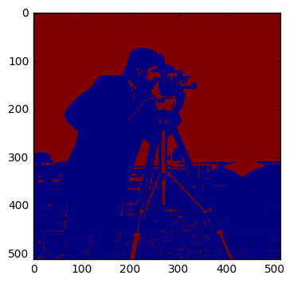

## Watershed Transformation: 

The watershed is a classical algorithm used for **segmentation**, that is, for separating different objects in an image.

Starting from user-defined markers, the watershed algorithm treats pixels values as a local topography (elevation). The algorithm floods basins from the markers, until basins attributed to different markers meet on watershed lines.  In many cases, markers are chosen as local
minima of the image, from which basins are flooded.

### Advantages: 

* Simplicity
* speed 
* complete division
* provide close contourns. 

### Drawbacks

* Oversegmentation 
* Sensitivity to Noise.
* Poor detection importatn areas with low contrats boundaries. 

## Algorithms: 

* Pengi : Multidegree Inmmersion simulation, based on Vincent and Soille. 
* Hsie h: Was aiming to small moving object detection. First, a noise removal technique is applied. 
* Frucci and Baja: Looks for homogenous regions, and there is a sucessive assignment of the regions: "Foreground" and "Background". 

* Hamarneh and Li:  Prior a shape appeareance knowledge is applied, then clustering-merging to improve in the oversegmentation. 

* Cheng: Uses this technique combined with segmentation using graph algorithms. 

* Smouvi and Masmoudi: Introduce a histogram. 

* Zanaty-AFifif Presented a seed region growing with image entropy. 


```python

```


```python
import numpy as np
import matplotlib.pyplot as plt
from scipy import ndimage as ndi

from skimage.morphology import watershed
from skimage.feature import peak_local_max
from skimage.data import camera

# Generate an initial image with two overlapping circles
x, y = np.indices((80, 80))
x1, y1, x2, y2 = 28, 28, 44, 52
r1, r2 = 16, 20
mask_circle1 = (x - x1)**2 + (y - y1)**2 < r1**2
mask_circle2 = (x - x2)**2 + (y - y2)**2 < r2**2
image = np.logical_or(mask_circle1, mask_circle2)
image=camera()
# Now we want to separate the two objects in image
# Generate the markers as local maxima of the distance to the background
distance = ndi.distance_transform_edt(image)
local_maxi = peak_local_max(distance, indices=False, footprint=np.ones((3, 3)),
                            labels=image)
markers = ndi.label(local_maxi)[0]
labels = watershed(-distance, markers, mask=image)

fig, axes = plt.subplots(ncols=3, figsize=(9, 3), sharex=True, sharey=True,
                         subplot_kw={'adjustable': 'box-forced'})
ax = axes.ravel()

ax[0].imshow(image, cmap=plt.cm.gray, interpolation='nearest')
ax[0].set_title('Overlapping objects')
ax[1].imshow(-distance, cmap=plt.cm.gray, interpolation='nearest')
ax[1].set_title('Distances')
ax[2].imshow(labels, cmap=plt.cm.spectral, interpolation='nearest')
ax[2].set_title('Separated objects')

for a in ax:
    a.set_axis_off()

fig.tight_layout()
plt.show()
```





```python
# Generate an initial image with two overlapping circles
x, y = np.indices((80, 80))
x1, y1, x2, y2 = 28, 28, 44, 52
r1, r2 = 16, 20
mask_circle1 = (x - x1)**2 + (y - y1)**2 < r1**2
mask_circle2 = (x - x2)**2 + (y - y2)**2 < r2**2
image = np.logical_or(mask_circle1, mask_circle2)
# Now we want to separate the two objects in image
# Generate the markers as local maxima of the distance to the background
distance = ndi.distance_transform_edt(image)
local_maxi = peak_local_max(distance, indices=False, footprint=np.ones((3, 3)),
                            labels=image)
markers = ndi.label(local_maxi)[0]
labels = watershed(-distance, markers, mask=image)

fig, axes = plt.subplots(ncols=3, figsize=(9, 3), sharex=True, sharey=True,
                         subplot_kw={'adjustable': 'box-forced'})
ax = axes.ravel()

ax[0].imshow(image, cmap=plt.cm.gray, interpolation='nearest')
ax[0].set_title('Overlapping objects')
ax[1].imshow(-distance, cmap=plt.cm.gray, interpolation='nearest')
ax[1].set_title('Distances')
ax[2].imshow(labels, cmap=plt.cm.spectral, interpolation='nearest')
ax[2].set_title('Separated objects')

for a in ax:
    a.set_axis_off()

fig.tight_layout()
plt.show()
```





```python
from skimage.segmentation import watershed
image=camera()
markers = np.zeros_like(image)
markers[image < 30] = 1
markers[image > 150] = 2
segme= watershed(image, markers)
plt.imshow(segme)
```


    <matplotlib.image.AxesImage at 0x116d34438>





```python

```

## Region Growing 

It comes from the MRI analysis. 

* Addams And Bischof: 

Seeded region growing. First order dependency whenever several pixels have the same difference to their neighborghs. And second order dependey one pixel has teh same difference measured to several regions. 


## Clustering: 

A cluster is a collection of object which are "similar". To define similarity we can use similatriy measure algorithms such as spatial neighbourghoods. 

### Drawbacks: 

* Time
* Complexity 
* Unwanted smoothing. 

### Algorithms : 

* Ahmed: He developed a Neighbourghood averagin additive term. And an algorithm bias corrected called BCFCM. 

* Liew and Yan: They look the spatial constraint and modeled the inhomogenity by b-spline surfaces. For checking voxel connectivity dissimilarity index are used. 

* Szilagyi: Used EMFCM algorithm to accelerate the image segmentation process. 
